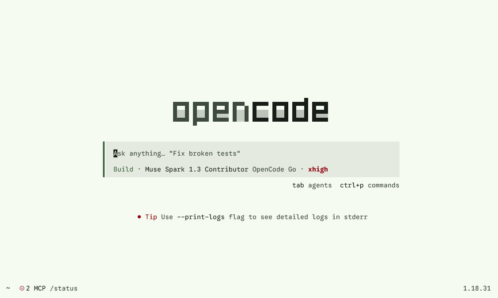
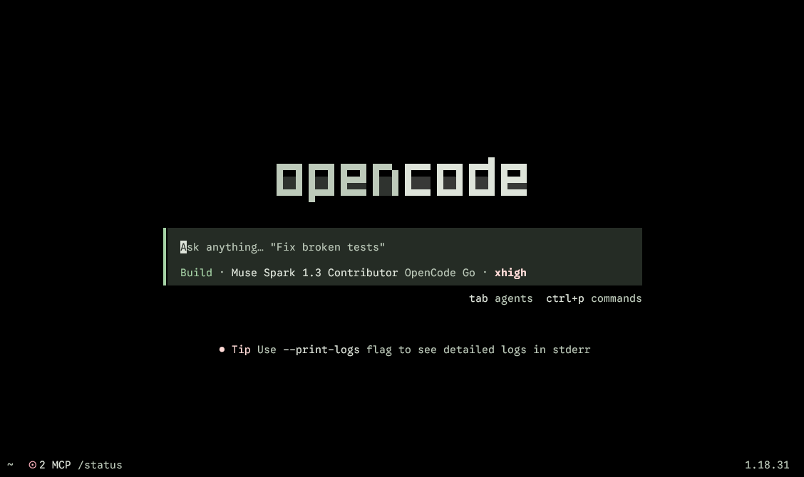
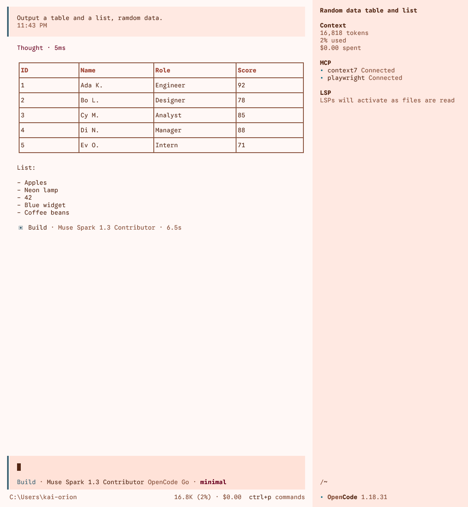
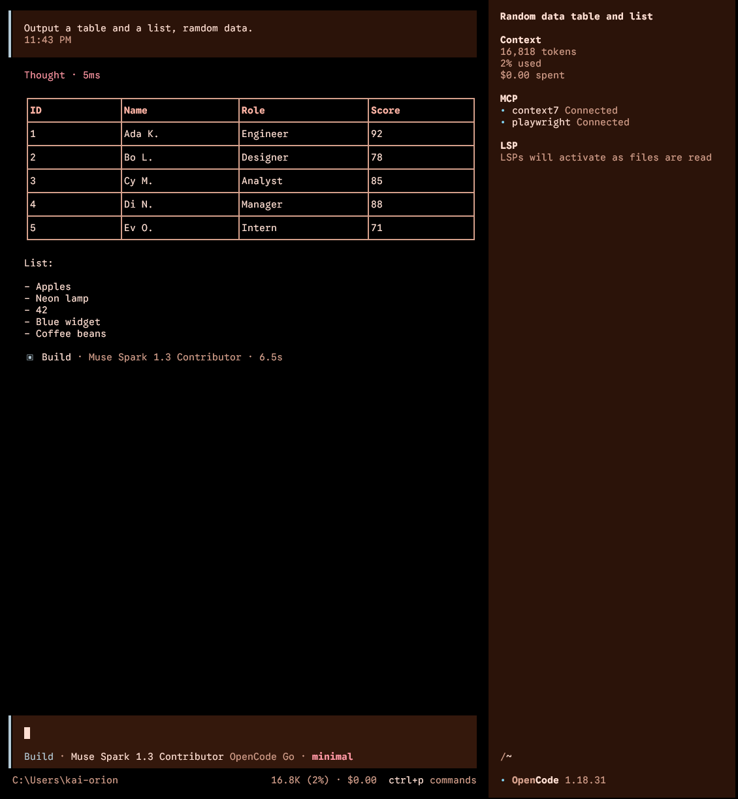

# MD3 Themes for OpenCode TUI

194 static [Material Design 3](https://m3.material.io/) (Material You) themes
for the [OpenCode](https://opencode.ai/) TUI: 9 variants × 12 hues,
plain + OLED, each file carrying **both** light and dark appearances
(OpenCode switches itself).

| Light                                                                    | Dark                                                                   |
| ------------------------------------------------------------------------ | ---------------------------------------------------------------------- |
|              |              |
|  |  |

More screenshots in [`docs/`](docs/).

## Requirements

- A terminal with **truecolor** support (`COLORTERM=truecolor`), otherwise
  colors degrade to the nearest 256-color approximation.
- Node.js 22+ (installer only; the themes themselves are plain JSON).

## Install

One-click full install (194 themes) into your user themes directory:

```sh
npx -y -p @sandlada/opencode-material-theme opencode-md3-themes install
```

Preview without installing:

```sh
npx -y -p @sandlada/opencode-material-theme opencode-md3-themes --dry-run
```

Install a subset (expressive greens, plain only):

```sh
npx -y -p @sandlada/opencode-material-theme opencode-md3-themes install --variant expressive --hue 120,150 --oled plain
```

List what the package ships:

```sh
npx -y -p @sandlada/opencode-material-theme opencode-md3-themes list
```

Manual install via git (bash):

```sh
git clone --depth 1 https://github.com/sandlada/opencode-material-theme.git
mkdir -p ~/.config/opencode/themes
cp opencode-material-theme/tui/*.json ~/.config/opencode/themes/
```

Manual install via git (PowerShell):

```powershell
git clone --depth 1 https://github.com/sandlada/opencode-material-theme.git
New-Item -ItemType Directory -Path "$env:USERPROFILE\.config\opencode\themes" -Force
Copy-Item -Path ".\opencode-material-theme\tui\*.json" -Destination "$env:USERPROFILE\.config\opencode\themes\" -Force
```

Single theme via curl:

```sh
mkdir -p ~/.config/opencode/themes
curl -o ~/.config/opencode/themes/md3-expressive-120-oled.json \
  https://raw.githubusercontent.com/sandlada/opencode-material-theme/main/tui/md3-expressive-120-oled.json
```

## Use

Pick a theme inside OpenCode with `/theme`, or pin one in `tui.json`:

```json
{ "$schema": "https://opencode.ai/tui.json", "theme": "md3-expressive-120-oled" }
```

## Theme names

`md3-{variant}-{hue}[-oled][-high|-reduced].json`, all lowercase:

- `{variant}`: `monochrome`, `neutral`, `tonal-spot`, `vibrant`,
  `expressive`, `fidelity`, `content`, `rainbow`, `fruit-salad`
- `{hue}`: HCT hue `0-330` step `30` (`monochrome` only ships hue `0`);
  every source is `Hct.from(hue, 75, 50)`
- each file holds light **and** dark (`{ "dark": …, "light": … }`);
  `-oled` marks the file whose dark half is pitch-black

## Regenerate from source

```sh
npm install
bun scripts/generate-md3-matrix.mjs --out ./tui
```

Single hue:

```sh
bun scripts/generate-md3-tokens.mjs --variant Expressive --hue 120 --out ./tui
```

Generation fails closed on schema drift, unknown roles, and contrast
violations (text 4.5, muted/wash 3.0; reduced text 3.0 by design).
See `AGENTS.md` for the mapping and naming contracts.

## License

MIT, copyright Kai-Orion & Sandlada.
